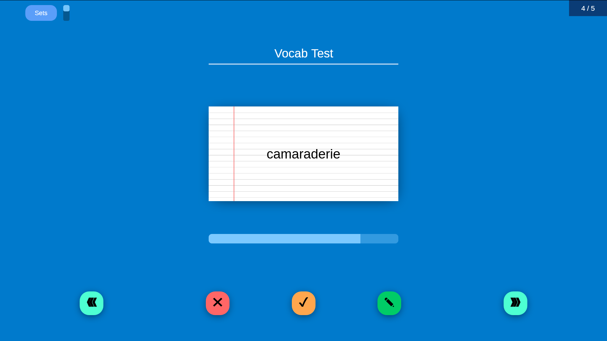
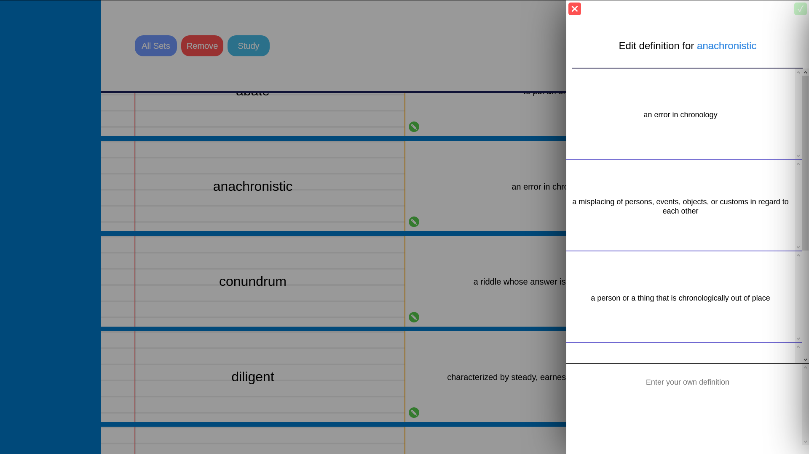
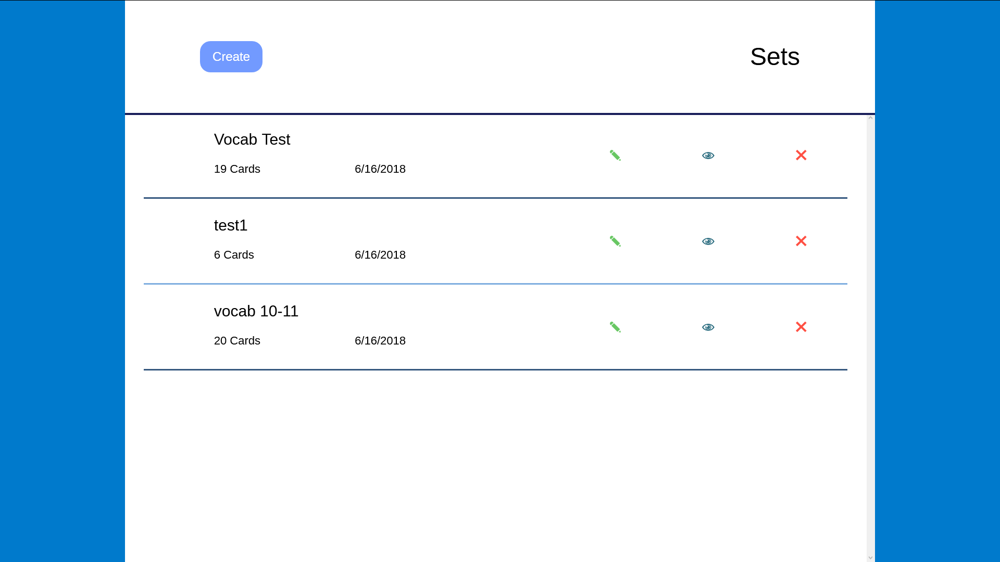

# srvsa
Spaced Repetition Vocabulary Study Aid: AP Computer Science Principles Final Project

- automatically makes vocab sets from words
- ability to change the definitions from a set or enter your own
- study the words in flashcard form
- definitions from merriam webster
- also supports urban dictionary, flip the switch in the top left when adding words

doesn't have spaced repetition yet
